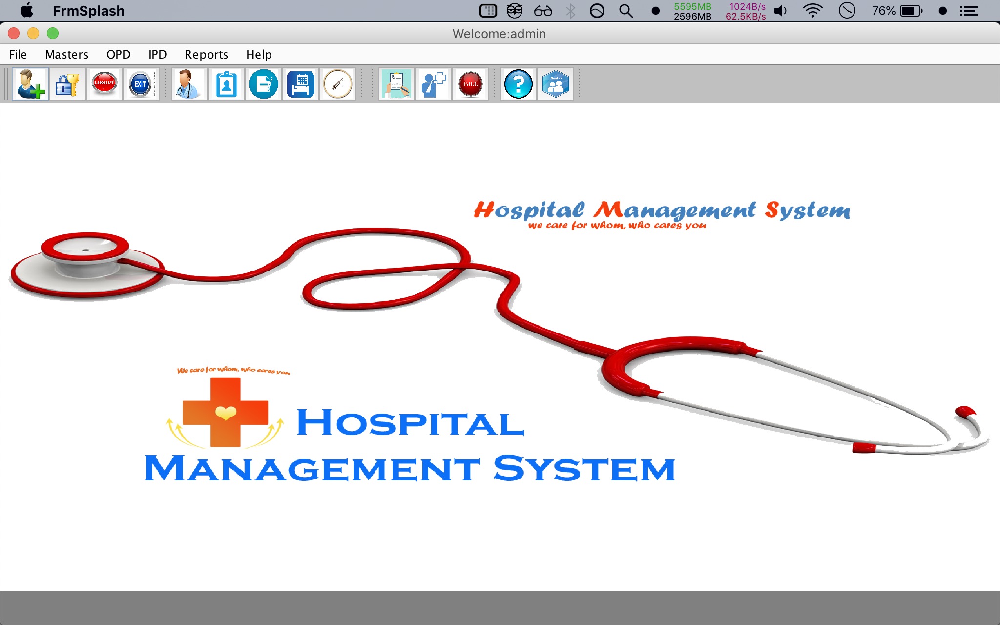

# Hospicio-Hospital-management_system-java-swing-mysql

Hospital-management_system in java-swing and mysql as backend

1. Import the hms.sql file in phpmyadmin
2. Edit the DConnection.java file as per the database creds.
3. Open the prject folder in eclipse and run. :)
